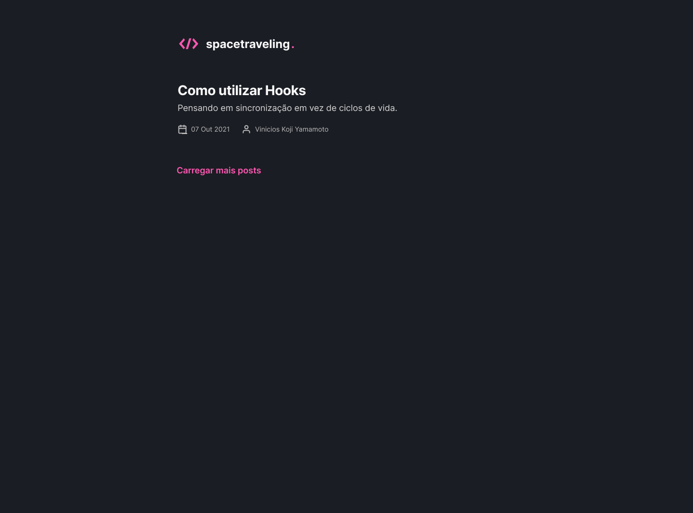
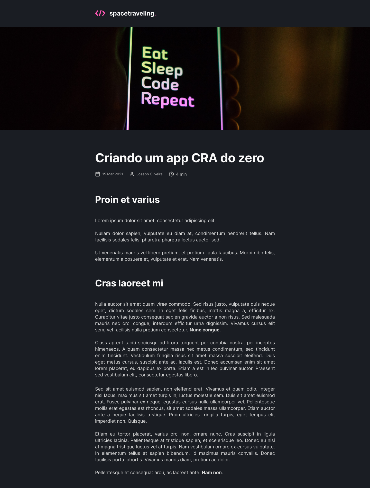

<p align="center" style="width=100%;">
  
</p>

# Sobre o projeto

Spacetraveling é um projeto desenvolvido no curso Ignite. tratase de um site de noticias desenvolvido em [Next](https://nextjs.org) com [Prismic](https://prismic.io) para CMS de noticias.

# 🛠 Tecnologias

As seguintes ferramentas foram usadas na construção do projeto:

- [React](https://reactjs.org/)
- [NextJS](https://nextjs.org/)
- [Typescript](https://www.typescriptlang.org/)
- [React Icons](https://react-icons.github.io/react-icons)
- [Prismic CMS](https://prismic.io/)
- [ESLint](https://eslint.org/)
- [Prettier](https://prettier.io/)
- [Jest](https://jestjs.io/pt-BR/)
- [Sass](https://sass-lang.com/)

# Layout web

<p align="center">
    
    
  </div>
</p>

## Rodando a aplicação

Quando clonar a aplicação não se esqueça de:

- Criar um arquivo .env com os seguintes dados:
  - Prismic CMS
    - PRISMIC_ENDPOINT
    - PRIMIC_ACCESS_TOKEN

```bash
# Clone este repositório
$ git clone https://github.com/viniyamamoto/ignite-reactjs-desafio-criando-um-projeto-do-zero
# Acesse a pasta do projeto no seu terminal/cmd
$ cd ignite-reactjs-desafio-criando-um-projeto-do-zero
# Instale as dependências
$ yarn install
# Execute o projeto
$ yarn dev
# A aplicação será aberta na porta:3000 - acesse http://localhost:3000
```

---
